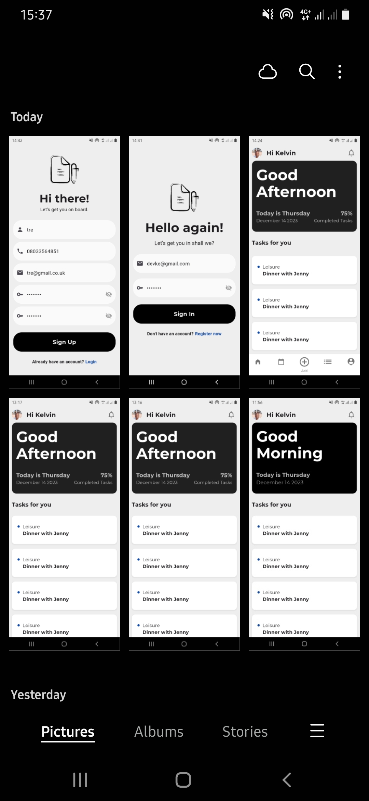

# Productivo - Event Tracker and ToDo List Mobile App

Welcome to Productivo, your go-to app for efficient event tracking and ToDo list management! 

Productivo is designed to help you stay organized, streamline your schedule, and effortlessly manage your daily tasks. Whether you're planning events or tackling your ToDo list, Productivo has all the features you need.

## Features

### 1. Event Tracking

- **Add Events:** Easily add new events with details such as title, date, time, and location.
- **Edit and Delete Events:** Update event details or remove events as needed.
- **View Events:** Get a clear overview of your upcoming events in a user-friendly calendar view.

### 2. ToDo Lists

- **Create ToDo Lists:** Organize your tasks into lists for better focus and clarity.
- **Add and Manage Tasks:** Add individual tasks to your lists, mark them as completed, or delete them.
- **Prioritize Tasks:** Set priorities for tasks to help you focus on what matters most.

### 3. Notifications

- **Reminders:** Receive timely reminders for upcoming events and tasks.
- **Customize Notifications:** Tailor notification settings based on your preferences.

### 4. User-Friendly Interface

- **Intuitive Design:** Enjoy a clean and user-friendly interface for a seamless experience.
- **Easy Navigation:** Access all features with a few taps, ensuring a hassle-free usage.

## Getting Started

1. **Installation:**
   - Download Productivo from the [Google Play].
   - Install the app on your mobile device.

2. **Account Creation:**
   - Sign up for a Productivo account to sync your data across multiple devices.

3. **Adding Events and Tasks:**
   - Use the "Add Event" or "Add Task" button to create new items.
   - Fill in the details and save the entry.

4. **Viewing and Managing:**
   - Navigate to the calendar to view your events or ToDo lists.
   - Edit or delete entries as needed.

5. **Notifications:**
   - Receive timely notifications for upcoming events and tasks.

Happy organizing with Productivo!

